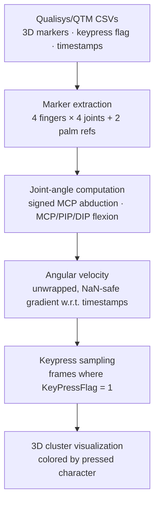

# 3D Hand Angles Plotting — Right Index Finger Kinematics

A vectorized biomechanical pipeline that extracts 3D joint angles and angular velocities of the right index finger from motion-capture typing data, then visualizes whether different keystrokes form separable clusters in joint-angle space.

## Why this exists

Each keystroke is executed by a finger trajectory that should, in principle, leave a distinct biomechanical signature — different MCP abduction for `y` vs. `n`, different PIP/DIP flexion for `u` vs. `m`, different angular-velocity profiles depending on which row the key lives in. This pipeline asks the **unimodal question**:

> *Can right-index finger kinematics, with no gaze and no language model, separate keystrokes into distinct clusters?*

Answering this is a precondition for richer multimodal text-entry systems. If hand kinematics alone cluster cleanly, gaze and language priors are reinforcement; if they don't, those modalities have to do most of the work.

This repository complements [`improved-gaze-typing-prediction`](https://github.com/mehrtam/improved-gaze-typing-prediction), which adds gaze and language priors on top of hand kinematics for end-to-end character prediction.

## Pipeline



## Geometric method

The kinematic computation is the substantive part — it's not just plotting:

**MCP abduction (signed).** A palm normal is computed from the triangle formed by the index MCP, little MCP, and palm midpoint. Each finger's MCP-to-tip vector is projected onto the palm plane. The angle between this projection and the index–little MCP "bar" is the magnitude; the sign comes from the cross product's agreement with the palm normal. This produces a *signed* abduction that distinguishes left-of-bar from right-of-bar deviation — necessary for separating keys like `y` vs `u`.

**MCP flexion.** Computed as `π/2 − angle(proximal_phalanx, palm_normal)`. The π/2 offset converts "angle with palm normal" into intuitive flexion (0° at neutral, increasing as the finger curls toward the palm).

**PIP and DIP flexion.** Inter-segment angles between consecutive phalanx vectors (`MCP→PIP`, `PIP→DIP`, `DIP→tip`).

**Angular velocity.** Time-gradient of the angle, with two safety steps: angles are unwrapped before differentiation to prevent ±180° wrap-around from inflating velocity, and rows with fewer than 3 valid samples per column are skipped to avoid spurious gradients.

## Targeted keys

QWERTY right-index territory: **y, h, n, u, j, m**.

## Repository structure

```
3D_hand_angles_plotting/
├── kinematics_analysis.py    # main pipeline (extraction + plotting)
├── requirements.txt
├── LICENSE                    # MIT
└── README.md
```

## Installation

```bash
git clone https://github.com/mehrtam/3D_hand_angles_plotting.git
cd 3D_hand_angles_plotting
pip install -r requirements.txt
```

## Data format

CSVs from a Qualisys motion-capture session, with 3D marker columns following the QTM naming convention. Required columns:

- **Index finger markers:** `QTMdc_R_Index_Prox_GLOBAL_X/Y/Z`, `QTMdc_R_Index_Inter_GLOBAL_X/Y/Z`, `QTMdc_R_Index_Distal_GLOBAL_X/Y/Z`, `QTMdc_R_Index_End_GLOBAL_X/Y/Z`
- **Other right-hand fingers** (Middle, Ring, Little) — same naming pattern, used for the palm-normal computation
- **Palm reference markers:** `QTMdc_R_Cin`, `QTMdc_R_Cout` (each with `_X/Y/Z`)
- **Event columns:** `Pressed_Letter`, `KeyPressFlag`, `TimeStamp`

## Usage

```bash
# Extract kinematics and render the default 3D MCP-Abd × MCP-Flex × PIP-Flex plot
python kinematics_analysis.py --data /path/to/csvs

# Choose a different plot
python kinematics_analysis.py --data /path/to/csvs --plot flexion_clusters
python kinematics_analysis.py --data /path/to/csvs --plot mcp_kinematics
python kinematics_analysis.py --data /path/to/csvs --plot flex_vel_grid

# Render every plot
python kinematics_analysis.py --data /path/to/csvs --plot all

# Just extract, no plotting (e.g. for downstream ML)
python kinematics_analysis.py --data /path/to/csvs --plot none --save-csv kinematics.csv
```

## Available visualizations

| Plot key | Axes | Use |
|---|---|---|
| `mcp_kinematics` | MCP Abduction × MCP Flexion × MCP Abduction Velocity | Mixed angle/velocity space |
| `flexion_clusters` | MCP Flexion × PIP Flexion × DIP Flexion | Pure flexion space |
| `mcp_pip_flex` | MCP Abduction × MCP Flexion × PIP Flexion | Default — combines abduction with flexion |
| `flex_vel_grid` | Flexion angle vs. flexion velocity, one panel per joint (MCP/PIP/DIP) | 2D phase portraits |

> Sample cluster figures will be added to `figures/` in a future commit.

## Tech stack

Python · NumPy (vectorized 3D geometry) · pandas (per-file processing) · matplotlib + seaborn (3D scatter / facet grids) · `concurrent.futures` (parallel CSV processing across workers)

## Applications

Motion-based predictive typing for AR/VR · accessibility and assistive input · neural & kinematic motor decoding · biomechanics and HCI research on motor intention.

## Citation

If you build on this work, please reference:

> Eslami, F. (2025). *3D Hand Angles Plotting — Right Index Finger Kinematics for Keystroke Analysis* [Computer software]. https://github.com/mehrtam/3D_hand_angles_plotting

## Contact

**Fateme (Mehrta) Eslami** — University of Birmingham
[GitHub](https://github.com/mehrtam) · [LinkedIn](https://www.linkedin.com/in/fateme-eslami-014179219/)

## License

MIT — see [LICENSE](LICENSE).
